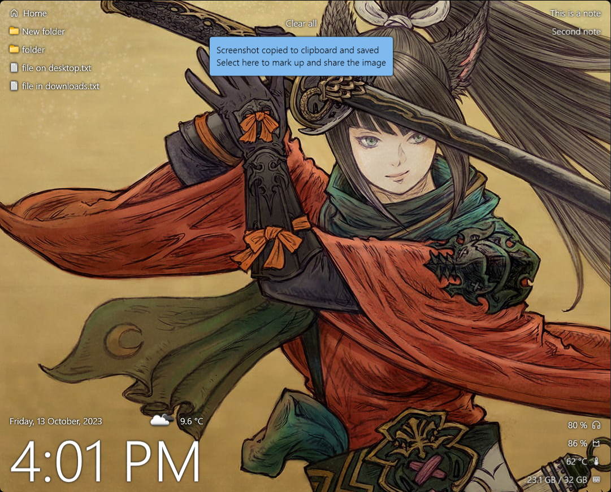

# Desktop
 A personal desktop app for secondary monitor.

Contains the following features:
* Wallpaper.
* Files / folders from Desktop and Downloads folders (supports creating, moving and deleting files).
* Notifications (supports windows notifications).
* Notes (supports notifications, and can be hidden).
* Time, date and weather widgets.
* System info widget:
  * Wireless bluetooth device battery (uses [Bluetooth battery monitor](https://www.bluetoothgoodies.com) api).
  * Cpu usage.
  * Cpu temperature.
  * Ram usage / available.
* Dimmer (dims screen when not active).
* Idle mode, displays widgets, rearranged, in larger font, meant for when AFK.
* Fix for white line at bottom of primary screen, when on Win11, and taskbar autohide is enabled.

## Credits
App icon: \
<a href="https://www.flaticon.com/free-icons/desktop" title="desktop icons">Desktop icons created by Freepik - Flaticon</a>

[WPFUI](https://github.com/lepoco/wpfui)\
[MahApps](https://github.com/MahApps/MahApps.Metro)\
[PostSharp](https://www.postsharp.net/)\
[WindowsHook](https://github.com/topstarai/WindowsHook)\
[LibreHardwareMonitor / Open hardware Monitor](https://github.com/LibreHardwareMonitor/LibreHardwareMonitor)
